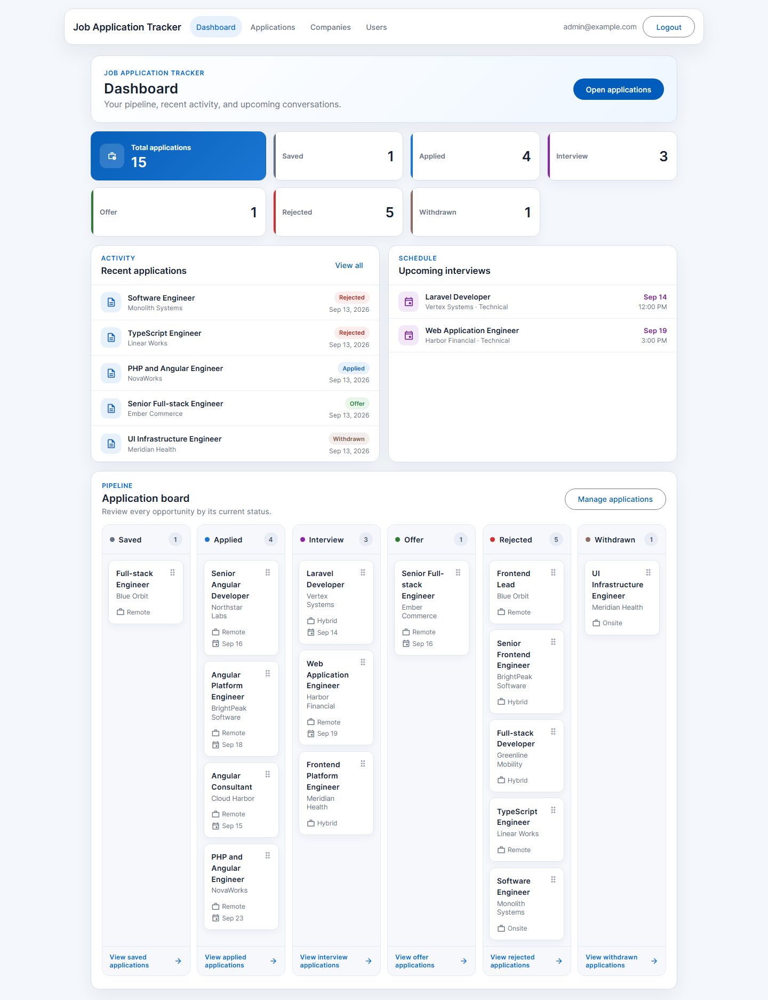
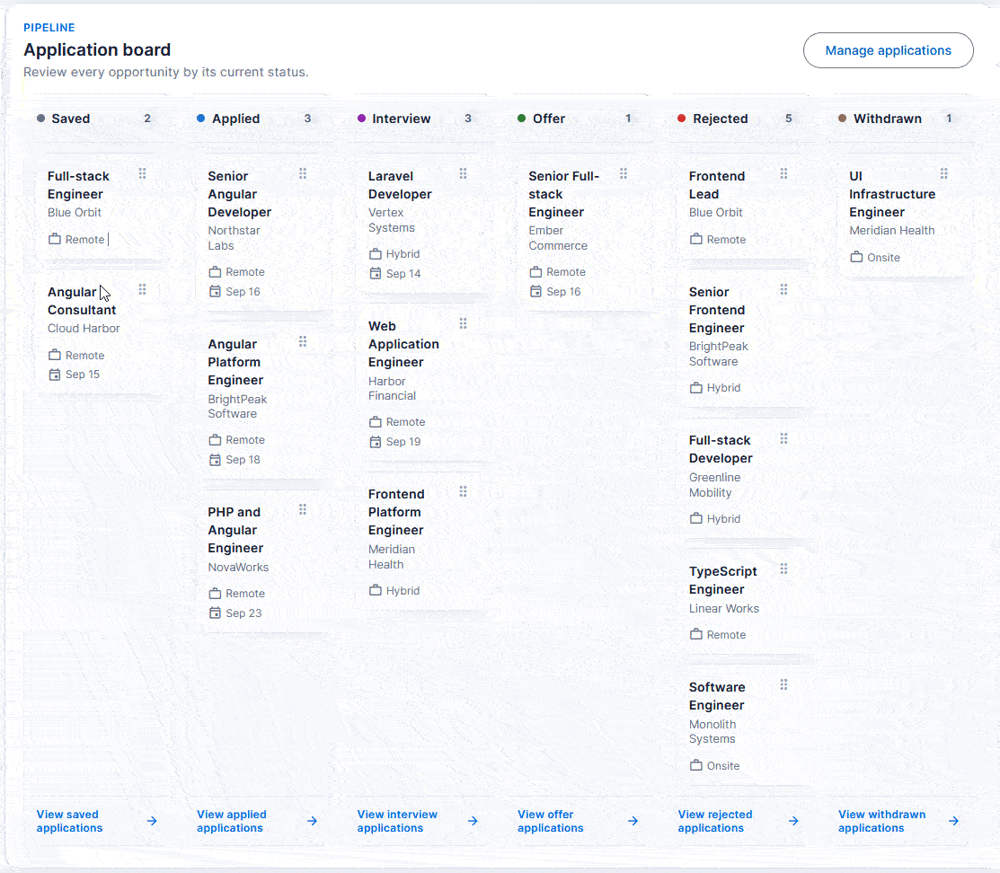
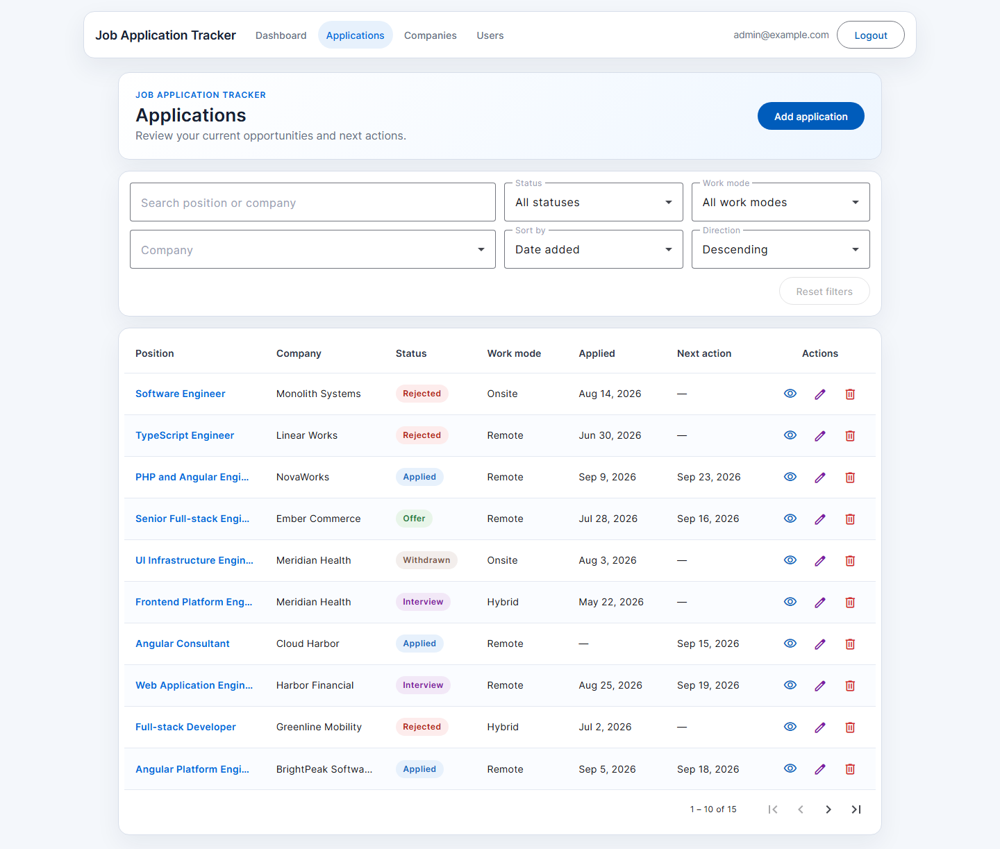
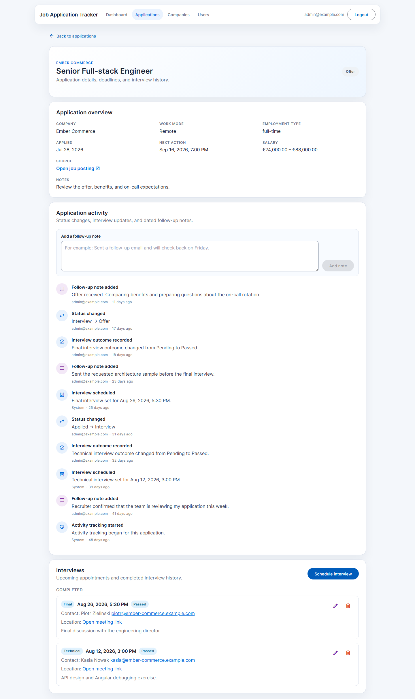

# Job Application Tracker

A portfolio-oriented full-stack application for organizing companies, job applications, interviews, and next steps throughout a private job-search pipeline. The frontend is built with Angular and the REST API with Laravel.

## Features

- Session-based SPA authentication with Laravel Sanctum
- Private Job Tracker data scoped to the authenticated account
- Company, job application, and interview CRUD workflows
- Six-stage application pipeline: saved, applied, interview, offer, rejected, and withdrawn
- Dashboard totals, recent applications, upcoming interviews, and a persistent drag-and-drop Kanban board
- Server-side search, filtering, whitelisted sorting, and Laravel pagination
- URL-backed list state, so filters and pages survive a browser refresh
- Immutable application activity timeline with status, interview, and manual follow-up history
- Structured request validation and consistent API error responses
- Responsive Angular Material interface with loading, empty, and retry states
- OpenAPI documentation and automated frontend/backend tests
- Separate user-management showcase with role-based permissions

## Screenshots

### Dashboard and pipeline summary



### Persistent Kanban drag and drop



### Application search and filters



### Application details, activity, and interviews



## Tech stack

- **Frontend:** Angular 21, standalone components, Angular Material, RxJS, SCSS
- **Backend:** Laravel 13, PHP 8.3+, Laravel Sanctum, Eloquent ORM
- **Database:** MySQL 8
- **API documentation:** Scramble / OpenAPI
- **Workspace tooling:** Nx for the Angular application and shared TypeScript contracts

## Repository structure

```text
apps/web/   Angular application
api/        Laravel REST API
shared/     Shared Job Tracker TypeScript contracts
```

Laravel remains a standard Composer application inside `api/`. Nx manages the Angular application and shared TypeScript library, while the root npm scripts provide convenient commands for the complete local stack.

## Prerequisites

- A currently supported Node.js release with npm
- PHP 8.3 or newer with the extensions required by Laravel and MySQL
- Composer 2
- MySQL 8.x

## First-time setup

Run the following commands from the repository root.

### 1. Install dependencies

```powershell
npm ci
cd api
composer install
cd ..
```

### 2. Configure Laravel

PowerShell:

```powershell
Copy-Item api/.env.example api/.env
```

macOS, Linux, or Git Bash:

```bash
cp api/.env.example api/.env
```

Generate the application key:

```powershell
cd api
php artisan key:generate
cd ..
```

The local `api/.env` file is intentionally ignored by Git. The tracked `api/.env.example` contains safe development defaults.

### 3. Create the MySQL database

Use an existing local MySQL account or create a dedicated development database and user:

```sql
CREATE DATABASE fullstack_user_management
    CHARACTER SET utf8mb4
    COLLATE utf8mb4_unicode_ci;

CREATE USER 'fullstack_app'@'localhost'
    IDENTIFIED BY 'choose_a_local_password';

GRANT ALL PRIVILEGES
    ON fullstack_user_management.*
    TO 'fullstack_app'@'localhost';

FLUSH PRIVILEGES;
```

Set the matching values in `api/.env`:

```dotenv
DB_CONNECTION=mysql
DB_HOST=127.0.0.1
DB_PORT=3306
DB_DATABASE=fullstack_user_management
DB_USERNAME=fullstack_app
DB_PASSWORD=choose_a_local_password
```

Use your own local password instead of the example value above.

### 4. Run migrations and seed demo data

```powershell
cd api
php artisan migrate --seed
cd ..
```

The seeded data is described in [Demo data](#demo-data).

### 5. Start the application

```powershell
npm run start:all
```

This starts both development servers:

- Angular application: http://localhost:4200
- Laravel API: http://127.0.0.1:8000/api/v1
- Health check: http://127.0.0.1:8000/api/v1/health
- OpenAPI UI: http://127.0.0.1:8000/api/v1/docs
- OpenAPI JSON: http://127.0.0.1:8000/api/v1/docs/openapi.json

## Demo accounts

Both accounts can fully manage their own companies, applications, and interviews. Their Job Tracker records are isolated: even the administrator cannot access another account's private tracker IDs.

| Account       | Email                | Password      | Job Tracker             | User management |
| ------------- | -------------------- | ------------- | ----------------------- | --------------- |
| Administrator | `admin@example.com`  | `admin12345`  | Full CRUD on owned data | Full CRUD       |
| Standard user | `viewer@example.com` | `viewer12345` | Full CRUD on owned data | Read-only       |

The standard account uses the `user` role in the API. Demo credentials are intended only for local development.

## Demo data

A fresh seeded database contains:

- 2 authentication accounts in `auth_users`
- 12 deterministic records in the separate demonstrational `users` table
- 15 companies, 26 job applications, and 12 interviews
- 15 applications for the administrator and 11 for the standard account

Each account has its own companies and enough applications to exercise pagination, search, filters, and multiple pipeline statuses. The Job Tracker records include all six application statuses, all three work modes, completed interviews, and pending upcoming interviews.

The `users` rows are not login accounts and are intentionally independent from `auth_users`. They exist only for the original role-based user-management demonstration.

## Main user flows

1. Sign in with either demo account.
2. Review application totals, recent activity, upcoming interviews, and the status board on the dashboard.
   Drag a card within a column or into another status to persist its exact board position.
3. Add companies before creating applications associated with them.
4. Search or filter applications by status, work mode, or company, and sort supported columns.
5. Open an application to review its activity timeline, add follow-up comments, and schedule, edit, or remove interviews.
6. Use the Users page to inspect the original demonstration module; only the administrator can mutate those records.

Job Tracker list filters, sorting, and pagination are represented in URL query parameters, so refreshing or sharing a list URL preserves the current view.

## Domain model

- **AuthUser** owns companies and provides the authenticated account boundary.
- **Company** belongs to one account and has many job applications. A company with applications cannot be deleted.
- **JobApplication** belongs to a company, stores pipeline/work-mode details, and has many interviews and immutable activity records. Deleting it also deletes its interviews and timeline.
- **Interview** belongs to a job application and stores type, schedule, contact details, notes, and an optional outcome.
- **User** is the independent record used by the original administrative showcase; it is not an authentication identity.

Ownership is enforced in Eloquent scopes, route binding, policies, and feature tests. Requests for another account's tracker resource return `404 Not Found` to avoid revealing whether the ID exists.

## Frontend routes

| Route               | Purpose                                                            |
| ------------------- | ------------------------------------------------------------------ |
| `/`                 | Public project overview                                            |
| `/login`            | Demo account sign-in                                               |
| `/dashboard`        | Status totals, recent applications, upcoming interviews, and board |
| `/applications`     | Filterable, sortable, paginated application list and CRUD          |
| `/applications/:id` | Application details and interview management                       |
| `/companies`        | Searchable company management                                      |
| `/users`            | Original user-management showcase                                  |

Authenticated feature routes are lazy-loaded by Angular.

## API overview

All REST endpoints use the `/api/v1` prefix except Sanctum's CSRF endpoint.

| Method                 | Endpoint                                                            | Access and purpose                            |
| ---------------------- | ------------------------------------------------------------------- | --------------------------------------------- |
| `GET`                  | `/sanctum/csrf-cookie`                                              | Public; initialize the SPA CSRF cookie        |
| `GET`                  | `/api/v1/health`                                                    | Public health check                           |
| `POST`                 | `/api/v1/auth/login`                                                | Public login                                  |
| `POST`                 | `/api/v1/auth/logout`                                               | Authenticated logout                          |
| `GET`                  | `/api/v1/auth/me`                                                   | Restore/read the authenticated session        |
| `GET`                  | `/api/v1/dashboard`                                                 | Account-scoped dashboard summary              |
| `GET/POST`             | `/api/v1/companies`                                                 | List/search or create owned companies         |
| `GET/PUT/PATCH/DELETE` | `/api/v1/companies/{company}`                                       | Manage an owned company                       |
| `GET/POST`             | `/api/v1/job-applications`                                          | List/filter or create owned applications      |
| `GET/PUT/PATCH/DELETE` | `/api/v1/job-applications/{job_application}`                        | Manage an owned application                   |
| `PATCH`                | `/api/v1/job-applications/{job_application}/move`                   | Reorder or change an application status       |
| `GET/POST`             | `/api/v1/job-applications/{job_application}/activities`             | List activity history or add a manual comment |
| `GET/POST`             | `/api/v1/job-applications/{job_application}/interviews`             | List or schedule interviews                   |
| `PUT/PATCH/DELETE`     | `/api/v1/job-applications/{job_application}/interviews/{interview}` | Update or remove an interview                 |
| `GET/POST`             | `/api/v1/users`                                                     | List users; administrator creates             |
| `GET/PUT/PATCH/DELETE` | `/api/v1/users/{user}`                                              | Read users; administrator updates/deletes     |

Example application query:

```text
GET /api/v1/job-applications?page=1&per_page=10&search=angular&status=applied&work_mode=remote&company_id=1&sort=applied_at&direction=desc
```

Collection responses follow Laravel pagination conventions, with records in `data`, navigation URLs in `links`, and pagination information in `meta`.

Validation and application errors use a consistent envelope containing `statusCode`, `errorCode`, `timestamp`, `path`, and `message`, with optional validation details.

## Authentication

The application uses Laravel Sanctum's stateful SPA flow:

1. Angular requests `/sanctum/csrf-cookie`.
2. Login credentials are posted to `/api/v1/auth/login`.
3. The browser stores Laravel's session cookie and sends it with protected requests.
4. On page refresh, Angular calls `/api/v1/auth/me` to restore the current account.
5. Logout invalidates the server session through `/api/v1/auth/logout`.

No access token is stored in browser storage. When using another HTTP client, persist cookies and send the CSRF cookie/header pair expected by Sanctum.

## Useful commands

Run these from the repository root:

| Command              | Purpose                                                     |
| -------------------- | ----------------------------------------------------------- |
| `npm start`          | Start the Angular development server                        |
| `npm run start:api`  | Start the Laravel development server                        |
| `npm run start:all`  | Start Angular and Laravel together                          |
| `npm run start:full` | Apply pending migrations, then start both servers           |
| `npm test`           | Run Angular and Laravel test suites                         |
| `npm run test:web`   | Run Angular tests                                           |
| `npm run test:api`   | Run Laravel tests                                           |
| `npx nx test shared` | Run shared-contract tests                                   |
| `npm run build`      | Create the Angular production build                         |
| `npm run db:migrate` | Apply pending Laravel migrations                            |
| `npm run db:seed`    | Seed the configured database                                |
| `npm run db:fresh`   | Recreate all tables and seed them; existing data is deleted |

## Migration history

The project was initially a user-management demo with a Node.js/NestJS backend, Drizzle ORM, and SQLite. The backend was migrated to Laravel, Eloquent, MySQL, and Sanctum while preserving the existing REST behavior and role-based access rules. The application was then expanded into the current Job Application Tracker.

The migration adopted Laravel conventions for request validation, API resources, authorization policies, session authentication, database migrations, seeders, pagination, and generated OpenAPI documentation. The original user-management feature remains available as an additional administrator/demonstration module instead of being discarded.

## Production considerations

The included credentials, example URLs, and environment defaults are for local demonstration only. For deployment, use unique secrets, disable debug mode, configure production database credentials and trusted frontend domains, serve both applications over HTTPS, and do not seed demo accounts or records.
